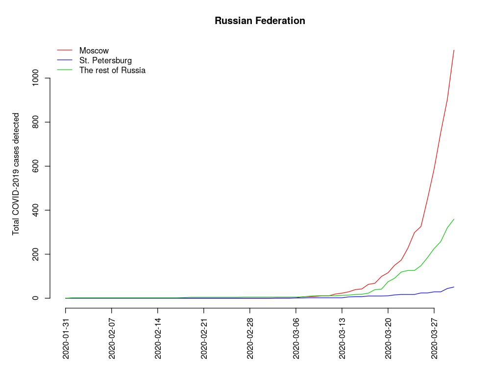
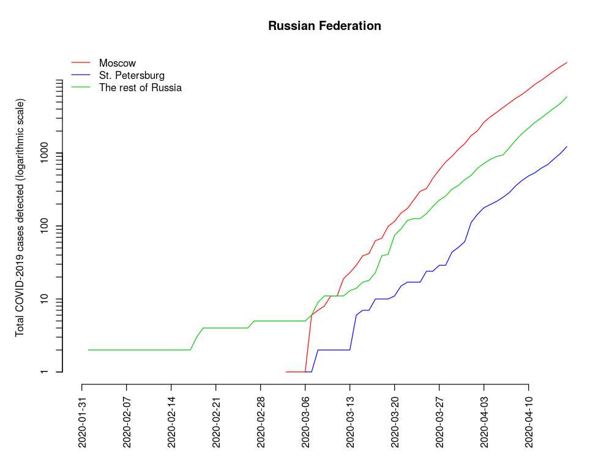
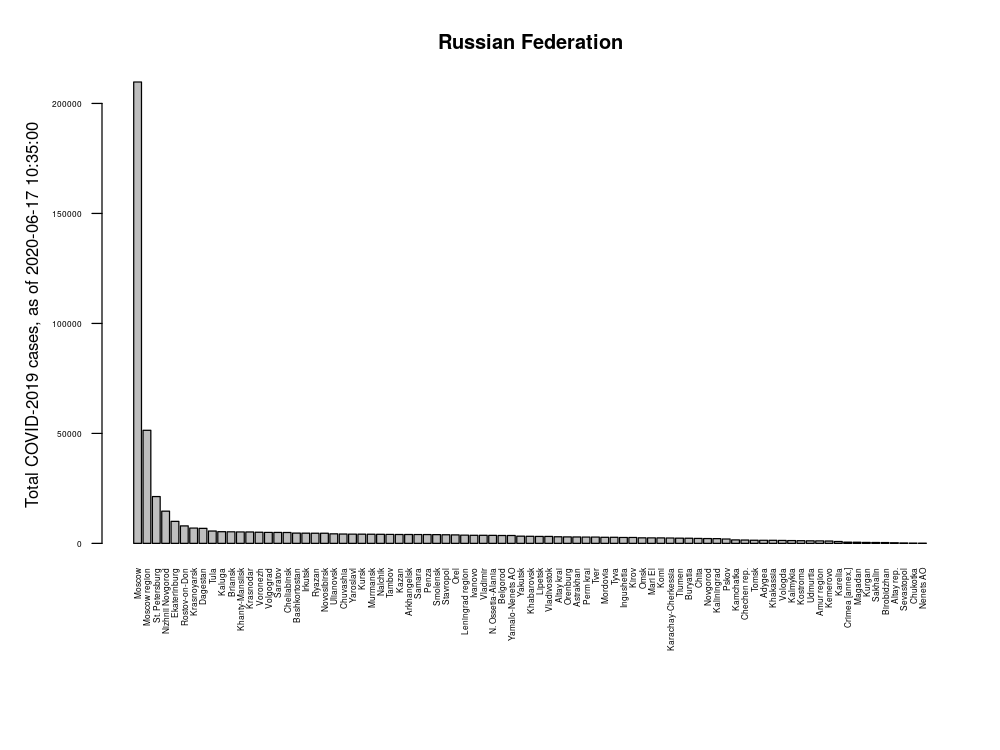
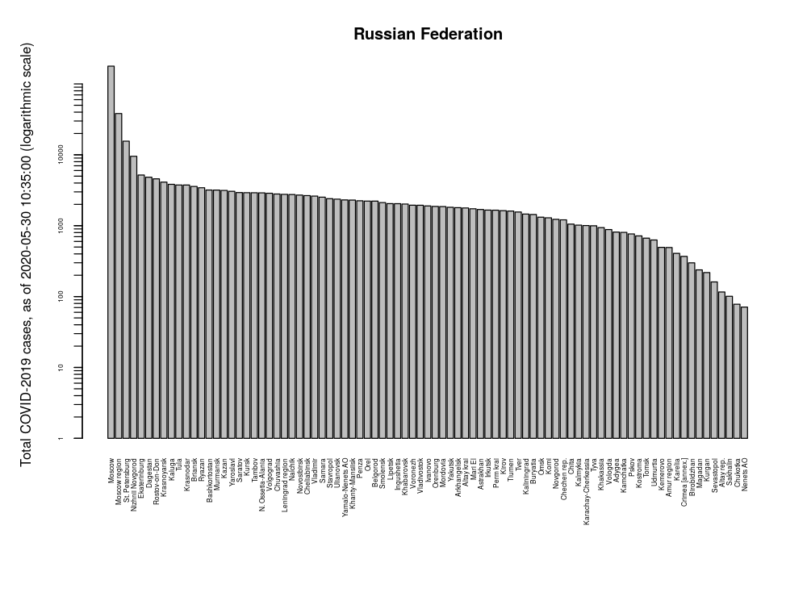
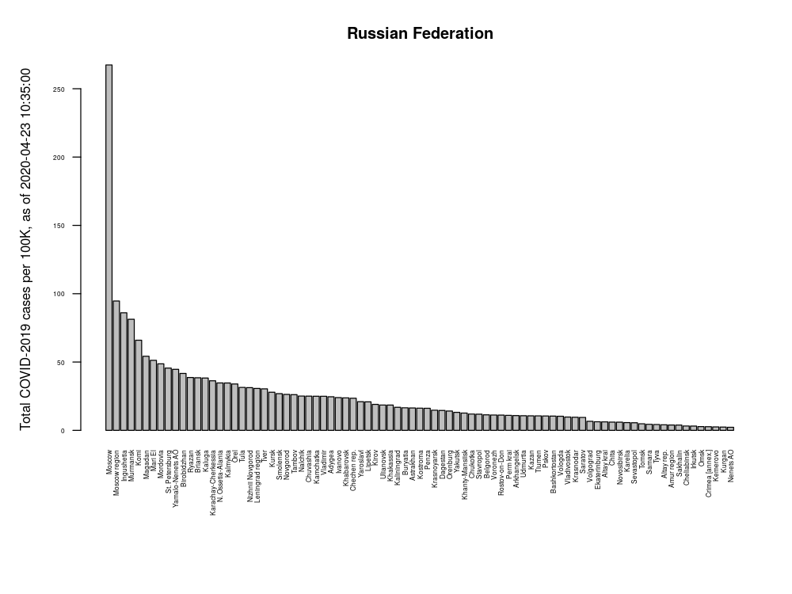
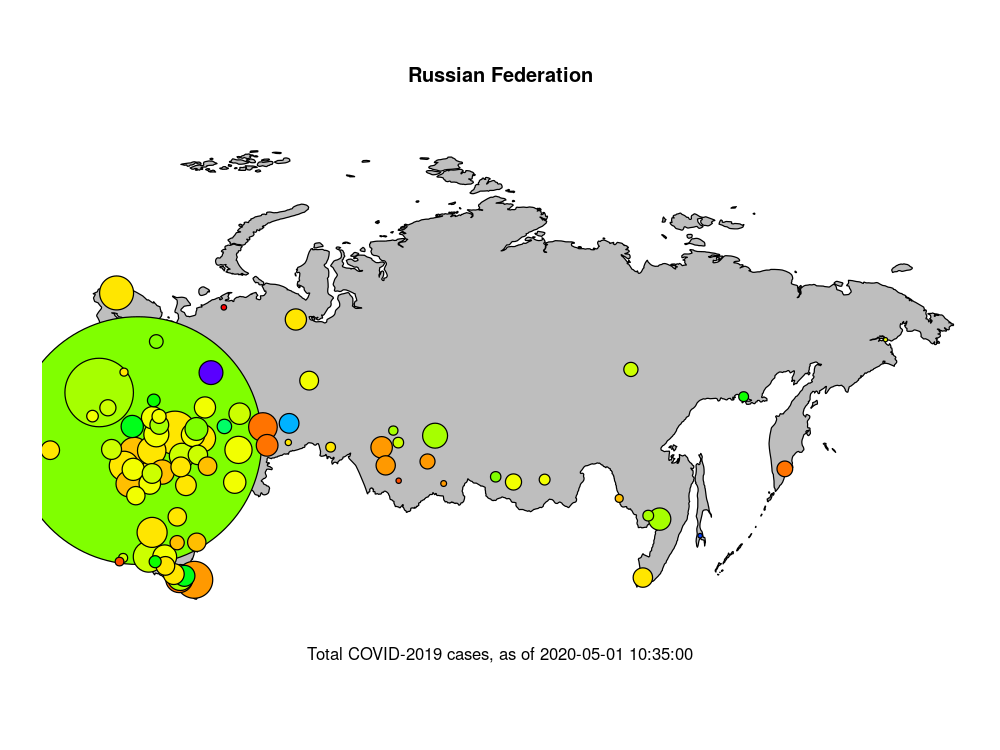
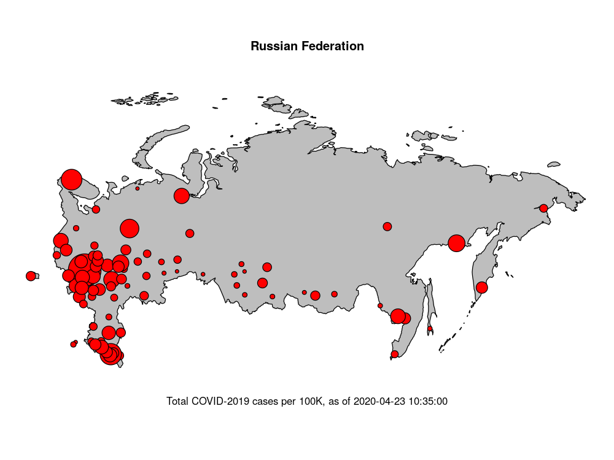

# Readme for COVID-2019.ru

This repo was created to keep records of the COVID-2019 epidemics in Russia. The dataset is based on the official reports of confimed cases. This means that the data lag behind the spread of the virus.

The visualizations derived from these data are as follows:

